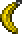

# Bananarang

## Summary

Right-click to eat a banana and gain Well Fed.

## Original role

The Bananarang is a banana-shaped Hardmode boomerang.

Its visual concept is extremely memorable, but its mechanics do not strongly use the banana joke.

## Rework

- Right-clicking while holding the Bananarang lets the player eat a banana.
- Eating the banana grants Well Fed for 5 minutes.
- A food sound plays when the effect is successfully applied.
- The effect does not reapply if the player already has a food buff.

## Notes

This rework is intentionally playful.

The Bananarang does not need a complicated combat system; letting it function as an edible banana gives it a memorable utility identity.

## Navigation

- [Back to Hardmode weapons](README.md)
- [Back to Home](../../README.md)
