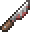

# Psycho Knife

## Summary

Stealth attacks can defeat weakened non-boss enemies and restore stealth.

## Original role

The Psycho Knife is a Hardmode melee weapon built around stealth.

It already has a unique identity, but its stealth gameplay can be made more rewarding when used for assassination-style attacks.

## Rework

- While attacking from stealth, the Psycho Knife can execute weakened non-boss enemies.
- The execution chance is 16%.
- The execution effect only applies to enemies below a health threshold.
- Very high-health enemies are protected by an additional limit.
- When an execution succeeds, the player gains a temporary Psycho Knife damage boost.
- The boost increases Psycho Knife damage by 20% for 4 seconds.

## Notes

This rework leans into the Psycho Knife's assassin fantasy.

It is not intended to delete bosses. Instead, it gives the weapon a chance to finish weakened regular enemies and reward successful stealth play.

## Navigation

- [Back to Hardmode weapons](README.md)
- [Back to Home](../../README.md)
