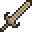
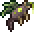
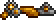
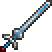
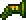
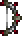
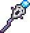
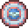

# Hardmode Weapon Reworks

This page lists Hardmode weapon reworks.

| Icon | Weapon | Summary |
|---|---|---|
|  | [Pearlwood Bow](PearlwoodBow.md) | Stronger arrows call weaker follow-up arrows from off-screen. |
|  | [Pearlwood Sword](PearlwoodSword.md) | Melee hits launch a Magic Missile. |
|  | [K.O. Cannon](KOCannon.md) | Greatly increased knockback; confused enemies take double damage from this weapon. |
|  | [Staff of Earth](StaffOfEarth.md) | Costs more mana, but boulders bounce and can hit many more times. |
|  | [Heat Ray](HeatRay.md) | Sustained hits build Heat; overheated targets briefly take double Heat Ray damage. |
|  | [Toxikarp](Toxikarp.md) | Toxic bubbles softly home toward enemies. |
|  | [Bladetongue](Bladetongue.md) | Direct blade hits also inflict Ichor. |
|  | [Candy Corn Rifle](CandyCornRifle.md) | Candy corn bullets bounce off blocks instead of vanishing immediately. |
|  | [Venus Magnum](VenusMagnum.md) | Repeated shots build focus, briefly increasing this weapon's critical chance. |
|  | [Clockwork Assault Rifle](ClockworkAssaultRifle.md) | Every third burst shot is guaranteed to critically strike. |
|  | [Beam Sword](BeamSword.md) | Beam hits summon two Arkhalis-like slashes on the target. |
|  | [Leaf Blower](LeafBlower.md) | Sometimes fires a stronger poisonous seed that inflicts Venom. |
|  | [Shadowbeam Staff](ShadowbeamStaff.md) | Each reflection increases damage, up to a cap. |
|  | [Marrow](Marrow.md) | Bone arrows inflict Osteoporosis, lowering enemy damage and increasing damage taken. |
|  | [Poison Staff](PoisonStaff.md) | Hits can spawn poisonous homing shrapnel. |
|  | [Frost Staff](FrostStaff.md) | Hits can conjure a short-lived icy burst around the target. |
|  | [Pirate Staff](PirateStaff.md) | Pirate hits steal a coin stack, then spend it for bonus damage. |
|  | [Toxic Flask](ToxicFlask.md) | Repeated cloud hits inflict Venom; venomous targets are easier to crit with this weapon. |
|  | [Psycho Knife](PsychoKnife.md) | Stealth attacks can defeat weakened non-boss enemies and restore stealth. |
|  | [Bananarang](Bananarang.md) | Right-click to eat a banana and gain Well Fed. |
|  | [Spectre Staff](SpectreStaff.md) | Spending mana with this staff periodically restores a little life. |
|  | [Blood Thorn](BloodThorn.md) | Can inflict Bleeding; hitting bleeding enemies grants Corpse Pile. |
|  | [Tome of Infinite Wisdom](TomeOfInfiniteWisdom.md) | Tornadoes speed up pages; redeploying quickly strengthens the next tornado. |
|  | [Flying Knife](FlyingKnife.md) | Repeatedly hitting the same enemy increases damage, up to a cap. |
|  | [Sergeant United Shield](SergeantUnitedShield.md) | Shield hits build bonus damage while thrown. |
