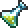

# Toxic Flask

## Summary

Repeated cloud hits inflict Venom; venomous targets are easier to crit with this weapon.

## Original role

The Toxic Flask is a Hardmode magic weapon that creates toxic clouds.

It has a strong area-control theme, but repeated hits from the cloud can feel like passive damage rather than a defined payoff.

## Rework

- Repeated Toxic Flask cloud hits are tracked on enemies.
- After 2 cloud hits, the target is inflicted with Venom for 4 seconds.
- When the Toxic Flask hits an enemy affected by Venom, it has an additional 20% chance to critically strike.

## Notes

This rework rewards keeping enemies inside the toxic cloud.

The first hits set up Venom, and venomous targets become more vulnerable to further Toxic Flask damage.

## Navigation

- [Back to Hardmode weapons](README.md)
- [Back to Home](../../README.md)
