# Pre-Hardmode Weapon Reworks

This page lists Pre-Hardmode weapon reworks.

| Icon | Weapon | Summary |
|---|---|---|
| 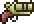 | [Flare Gun](FlareGun.md) | The Flare Gun is reworked into a lightweight support weapon that marks enemies with burning flares, making them easier to damage. |
| 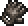 | [Ale Tosser](AleTosser.md) | The Ale Tosser is reworked into a risky brawler-style throwing weapon that becomes stronger when used while Tipsy. |
| 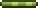 | [Blowpipe](Blowpipe.md) | The Blowpipe is reworked into a simple early poison weapon that gives seeds and other Blowpipe shots a small status effect role. |
| 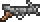 | [Harpoon](Harpoon.md) | The Harpoon is reworked into a follow-up weapon that becomes stronger when used against bleeding enemies. |
| 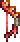 | [Blood Rain Bow](BloodRainBow.md) | The Blood Rain Bow is reworked into a bleeding-focused bow that rewards repeatedly shooting enemies that are already wounded. |
| 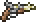 | [Flintlock Pistol](FlintlockPistol.md) | The Flintlock Pistol is reworked into a timing-based pistol that rewards deliberate shots instead of rapid fire. |
| 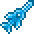 | [Frost Daggerfish](FrostDaggerfish.md) | The Frost Daggerfish is reworked into a simple frost-themed throwing weapon that can apply Frostburn on hit. |
| 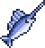 | [Swordfish](Swordfish.md) | The Swordfish is reworked into a water-focused spear that performs better while the player is underwater. |
| 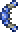 | [Shroomerang](Shroomerang.md) | Returning throws shed drifting damaging mushrooms. |
| 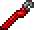 | [Combat Wrench](CombatWrench.md) | Deals triple damage while returning to you. |
| 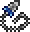 | [Chain Knife](ChainKnife.md) | Pulls enemies, inflicts Bleeding, and is stronger against bleeding targets. |
| 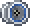 | [Rally](Rally.md) | Every third hit on the same enemy deals triple damage. |
| 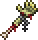 | [Zombie Arm](ZombieArm.md) | Hits fling rotten blood that poisons enemies. |
| 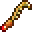 | [Mandible Blade](MandibleBlade.md) | Right-click performs Mandible Crush, a two-jaw bleeding slash. |
| 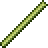 | [Breathing Reed](BreathingReed.md) | Swings release short-lived bubbles from the reed tip. |
| 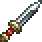 | [Gladius](Gladius.md) | Attacks cycle through 70%, 130%, and 150% damage; critical hits grant defense. |
| 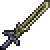 | [Bone Sword](BoneSword.md) | Swings can fire bone projectiles. |
| 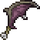 | [Bat Bat](BatBat.md) | The Bat Bat is reworked into a more aggressive life-trade weapon that hurts the player slightly on hit, then heals based on the damage dealt. |
| 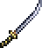 | [Katana](Katana.md) | Sheathed slashes deal greatly increased damage and cannot critically strike. |
| 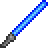 | [Blue Phaseblade](BluePhaseblade.md) | Hits build meteor counters. Right-click spends them for a blue color-specific effect. |
| 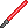 | [Red Phaseblade](RedPhaseblade.md) | Hits build meteor counters. Right-click spends them for a red color-specific effect. |
| 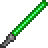 | [Green Phaseblade](GreenPhaseblade.md) | Hits build meteor counters. Right-click spends them for a green color-specific effect. |
| 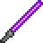 | [Purple Phaseblade](PurplePhaseblade.md) | Hits build meteor counters. Right-click spends them for a purple color-specific effect. |
| 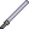 | [White Phaseblade](WhitePhaseblade.md) | Hits build meteor counters. Right-click spends them for a white color-specific effect. |
| 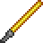 | [Yellow Phaseblade](YellowPhaseblade.md) | Hits build meteor counters. Right-click spends them for a yellow color-specific effect. |
| 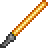 | [Orange Phaseblade](OrangePhaseblade.md) | Hits build meteor counters. Right-click spends them for an orange color-specific effect. |
