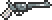

# Revolver

## Summary

The Revolver is reworked into a risk-reward gun built around Gunman Mode, timed reload cues, and a powerful Death Gun shot.

## Original role

The Revolver is a Pre-Hardmode gun sold by the Traveling Merchant.

It has decent basic stats for its stage, but its identity is fairly plain compared to other guns with stronger gimmicks or clearer progression roles.

## Rework

- Right-click toggles Gunman Mode.
- While Gunman Mode is active, the Revolver can be fired repeatedly.
- After firing, a reload cue sound plays once the Gunman timing window is ready.
- Firing after the reload cue builds 1 Gunman Counter.
- Gunman Counter can stack up to 10 times.
- Each Gunman Counter gives a 10% chance for the next shot to consume all counters.
- When Gunman Counter is consumed, the shot becomes a Death Gun.
- Death Gun uses a Death Laser-style projectile.
- Death Gun can pierce up to 5 enemies.
- Against non-boss enemies with 1000 HP or less, Death Gun instantly defeats the target.
- Against non-boss enemies above 1000 HP, Death Gun deals damage equal to 10% of the target's current HP.
- Bosses cannot be instantly killed by Death Gun and are left at 1 HP instead.
- After Death Gun activates, Gunman Counter cannot be consumed again for 10 seconds.

## Notes

This rework is designed to make the Revolver feel like a dramatic gunslinger weapon.

Unlike the Flintlock Pistol, which rewards strict single-shot timing, the Revolver's Gunman Mode allows repeated firing while still rewarding players who listen for the reload cue. The player can keep shooting normally, but timed shots build toward a high-impact Death Gun.

The goal is to give the Revolver a distinct identity: a stylish sidearm that alternates between rapid pressure and rare execution shots.

## Navigation

- [Back to PreHardmode weapons](README.md)
- [Back to Home](../../README.md)
